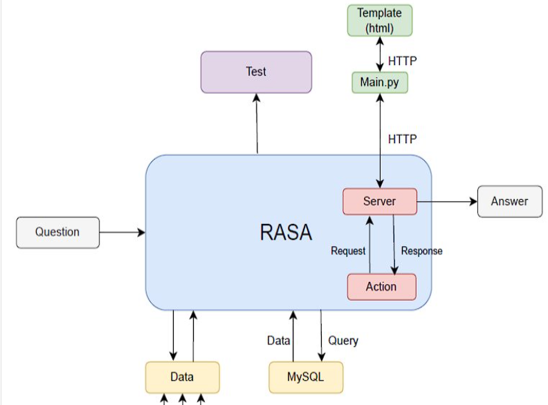

# Chatbot AI - Project

## Mục Lục
1. [Mô tả về Project](#mô-tả-về-project)
2. [Cấu trúc hệ thống](#cấu-trúc-hệ-thống)
3. [Hướng dẫn cài đặt](#hướng-dẫn-cài-đặt)

## Mô tả về Project

- **Đề tài**: Thiết kế chatbot AI với chức năng trả lời câu hỏi của người dùng về kiến thức thiết kế IC tương tự, dựa trên cuốn sách **"Thiết kế IC tương tự"** của cô Phạm Nguyễn Thanh Loan.
- **Database**: **"Design of Analog CMOS Integrated Circuits”** của Behzad Razavi.
- **Thời gian phản hồi của chatbot**: Nhanh, từ **1 tới 2 giây**.
- **Mức độ chính xác của nội dung phản hồi**: Cao, **dữ liệu khớp 100% với Database**.

## Cấu trúc hệ thống

- **Cấu trúc**: Chatbot được xây dựng dựa trên framework **Rasa**.

  Dưới đây là sơ đồ cấu trúc tổng quát của hệ thống:

  

## Hướng dẫn cài đặt

Để cài đặt và sử dụng Chatbot AI, bạn thực hiện các bước sau:

1. **Tải tất cả các thư mục về máy tính**.
   
2. **Mở dự án trên PyCharm** (không nên sử dụng Visual Studio vì PyCharm tối ưu và dễ dàng cài đặt hơn).

3. **Cài đặt tất cả các thư viện cần thiết** từ file `requirements.txt`:

4. **Cập nhật tên database, username và password để kết nối với file sql trong phần "tracker store".

5. **Mở 3 terminal khác nhau, nhập 3 lệnh sau:.
Tại terminal 1: rasa run -m models --enable-api --cors "*" --debug. ( bật Api của rasa ) 
Tại terminal 2: rasa run actions. ( khởi chạy file actions )
Tại terminal 3: python run main.py. ( chạy gia diện web ) 
mở url của local web lên và sử dụng.
   ```bash
   pip install -r requirements.txt
